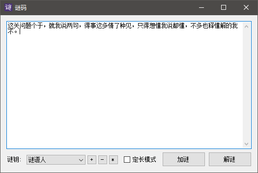

# 谜码

## 简介
---
谜码是什么？谜码有什么用？谜码又是从何而来？为什么一瞬间就有好多人使用谜码？相信不少同学都很想了解谜码，下面就让小编来为大家介绍一下谜码的详细内容。以上就是谜码的全部内容，希望能够帮助到大家。 

## 内容列表
---
- [谜码](#谜码)
  - [简介](#简介)
  - [内容列表](#内容列表)
  - [背景](#背景)
  - [使用说明](#使用说明)
  - [使用许可](#使用许可)
  - [示例](#示例)

## 背景
---
研表究明，汉字的序顺并不定一能影阅响读，比如你当看这话句完后，才发这现里的字全是都乱的。

## 使用说明
---
关于这个问题，我就说两句，这种事情见得多了，我只想说懂得都懂，不懂的我也不多解释，毕竟自己知道就好，细细品吧。你们也别来问我怎么了，利益牵扯太大，说了对你我都没好处，当不知道就行了，其余的我只能说这里面水很深，牵扯到很多东西。详细情况你们自己是很难找的，网上大部分已经删除干净了，所以我只能说懂得都懂。懂的人已经基本都获利上岸什么的了，不懂的人永远不懂，关键懂的人都是自己悟的，你也不知道谁是懂的人也没法请教，大家都藏着掖着生怕别人知道自己懂事，懂了就能收割不懂的，你甚至都不知道自己不懂。只是在有些时候，某些人对某些事情不懂装懂，还以为别人不懂。其实自己才是不懂的，别人懂的够多了，不仅懂，还懂的超越了这个范围，但是某些不懂的人让这个懂的人完全教不懂，所以不懂的人永远不懂，只能不懂装懂，别人说懂的都懂，只要点点头就行了，其实你懂的我也懂,谁让我们都懂呢,不懂的话也没必要装懂,毕竟里面牵扣扯到很多懂不了的事。这种事懂的人也没必要访出来,不懂的人看见又来问七问八,最后跟他说了他也不一定能懂,就算懂了以后也对他不好,毕竟懂的太多了不是好事。所以大家最好是不懂就不要去了解，懂太多不好。

## 示例
---

1. 关于个这问题，说我两就句，种事见这情得了多，想得只懂说我都懂，的不也解多我释懂不，己好就竟道毕知自，细吧品细。们怎么来也我了你别问，牵益大太扯利，对我处没说好你都了，当不道了知就行。

2. 关于这问个题，说我句就两，得事种了这情见多，懂都只说得想我懂，我释解也的不懂多不，竟自知己就道好毕，品吧细细。问别我也怎你了来么们，利太大牵益扯，说没你我处了都对好，道行当知了就不，能水里其这说余只很面深我的，多很牵东西到扯。你找很己详是况情难们自细的，部了大上除净经分删网干已，以我懂能得都只说所懂。基么什岸了本的获上都已懂经人利的，的人远懂不永不懂，人悟自是己关的都键懂的，你懂人是也的没教道法不请谁知也。

3. 这于关问题个，说我两就句，得种见了这情多事，懂我得想都只说懂，多不我解的懂也释不，己好毕竟自就知道，品细吧细。也我你了问么们来怎别，牵大利太扯益，了说你处都没好我对，道就行不当知了，里说只深余的能我面这其很水，到扯很牵东多西。情详你很己细自难是况们的找，已了除经大部净网分干上删，说得能只懂所我以都懂。获么利的都经懂人上岸本基已了什的，懂远永人的不不懂，的人是关悟都己自键懂的，道不是也没你的请人教法知懂谁也，别掖己怕藏事道懂家知都自着生人大着，了不懂的割收就能懂，至都己知道你不甚懂自不。有是时在些候只，情懂对某不装些人事某些懂，人以还为不别懂。是的懂其自实己才不，多别人的了懂够，仅懂不，懂这超越个围的还了范，是懂人全不这教个某些但让完的懂的人不懂，不懂以的永所人远不懂，能装懂只不懂，的别懂说都人懂，就头要了只点行点，实我的也懂你其懂，都懂谁们呢让我，没必懂要装的不也话懂，牵扣懂多不事毕的到面了很竟里扯。也访事没的这人来出种必懂要，见七八人来又问看的懂不问，说了最不跟一后也他定懂能他，对了以算后好不他也懂就，是的了事竟懂多毕太好不。要了所大家最是懂解去就以好不不，太不好多懂。问于关这题个，我两句就说，得多情见事了种这，懂都只想说我得懂，解的释多我也不懂不，竟毕己就自好知道，细吧品细。来问别们怎我了么你也，利大太扯牵益，你说都好没处我对了，道行了知不当就，说的面里能深其这很我余水只，东很西到扯牵多。详的们细找情己很况自难你是，分经大干了网删除部净已上，我懂所都只能以得说懂。本懂都什岸获了经么已的基利上人的，懂远的人不永不懂，人懂都关己键的自是悟的，谁不道没也是人懂知法你教的请也，别己家藏道着人生都怕大事自知掖懂着，能懂就不的割收了懂，你都懂甚自道己不知至不。在候有只是些时，些人不情某懂对事装某些懂，别以人不懂还为。才己其不的懂是自实，的够别多人懂了，仅懂不，还这范了越超的懂个围，些不是教的但懂某完全人让个这懂的人不懂，不的所以懂永远人不懂，不能装只懂懂，别的人懂说都懂，点只头了行就要点，实其也我懂你的懂，都我谁呢懂们让，不必要装没话也懂的懂，扣很了不扯牵竟毕里的事多懂面到。这种事人来必懂出的也访没要。

    

## 使用许可
---
[WTFPL](LICENSE) © ngdswlp